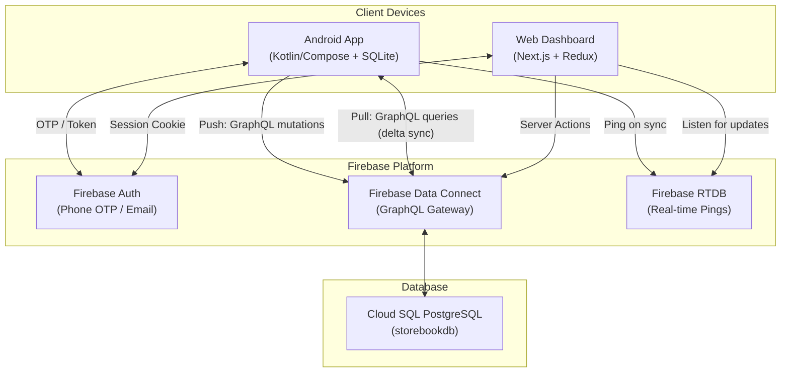

# 00 — Architecture Overview

## Project Summary

**StoreBook** is a multi-tenant retail inventory management platform designed for Indian small businesses. It provides offline-first Android POS capabilities with cloud synchronization to a Next.js web dashboard.

---

## Tech Stack

| Layer | Technology |
|---|---|
| Android App | Kotlin, Jetpack Compose, SQLite (raw), WorkManager, Firebase Auth |
| Shared KMP Module | Kotlin Multiplatform (domain models, skeleton loaders) |
| Web Dashboard | Next.js 14 (App Router), React, TypeScript, Redux Toolkit + redux-persist |
| Backend (Cloud) | Firebase Data Connect → Cloud SQL (PostgreSQL), Firebase Auth, Firebase RTDB |
| Backend (Legacy) | Express.js + SQLite (local dev REST API — largely unused in production) |
| Auth | Firebase Phone Auth (OTP), Firebase Email/Password (staff), Firebase Admin SDK (session cookies) |
| Billing | Google Play Billing Library v7 (Android), Stripe/Razorpay (web — UNCONFIRMED) |
| SDK Generation | Firebase Data Connect CLI → Kotlin + TypeScript generated SDKs |

---

## Architecture Diagram



---

## Folder Structure

```
store-book/
├── app/                          # Android app module
│   └── src/main/java/com/storebook/inventoryapp/
│       ├── MainActivity.kt
│       ├── StoreBookApplication.kt
│       ├── data/
│       │   ├── billing/          # GST tax engine
│       │   ├── local/            # SQLite DbHelper
│       │   ├── model/            # Ad-config response model
│       │   ├── network/          # Retrofit API client
│       │   ├── play/             # Google Play Billing
│       │   ├── repository/       # StoreBookRepository (all DB ops)
│       │   └── sync/             # SyncWorker (push/pull)
│       ├── dataconnect/          # Generated Data Connect Kotlin SDK
│       ├── services/             # FCM messaging service
│       ├── ui/
│       │   ├── components/       # Reusable UI widgets
│       │   ├── navigation/       # Routes + NavHost
│       │   ├── screens/          # All Compose screens
│       │   ├── theme/            # Material3 theme
│       │   └── viewmodels/       # StoreBookViewModel (main state)
│       ├── utils/                # Utilities (PDF, Excel, currency, etc.)
│       └── workers/              # ExpiryCheckWorker
├── shared/                       # KMP shared module
│   └── src/commonMain/…/domain/models/Models.kt  # Domain data classes
├── web/                          # Next.js web app
│   └── src/
│       ├── app/                  # App Router pages
│       │   ├── admin/            # Admin panel pages
│       │   ├── items/            # Inventory page
│       │   ├── sales/            # Sales + POS page
│       │   ├── expenses/         # Expenses page
│       │   ├── udhaar/           # Credit ledger page
│       │   ├── reports/          # Analytics page
│       │   ├── quotations/       # Estimates page
│       │   ├── settings/         # Settings page
│       │   ├── login/            # Login page
│       │   └── actions.ts        # Server Actions
│       ├── components/           # Shared UI components
│       ├── dataconnect/          # Generated Data Connect TS SDK
│       ├── lib/                  # Firebase init, session, sanitize
│       └── store/                # Redux store (cart, inventory, udhaar)
├── dataconnect/                  # Firebase Data Connect config
│   ├── schema/schema.gql         # PostgreSQL schema (13 types)
│   └── connector/
│       ├── queries.gql           # 22 queries
│       └── mutations.gql         # 23 mutations
├── backend/                      # Legacy Express REST API
└── docs/                         # This documentation
```

---

## How Components Connect

### Android → Cloud
1. User performs CRUD locally on SQLite.
2. `SyncWorker` (via WorkManager) pushes unsynced records (`is_synced=0`) to Firebase Data Connect using generated Kotlin SDK mutations.
3. `SyncWorker` pulls delta updates from cloud using `lastSync` timestamp stored in EncryptedSharedPreferences.
4. After sync, writes `store_updates/$storeId/last_update` to Firebase RTDB to notify other clients.

### Web → Cloud
1. Each page's server component calls `getSession()` to verify session cookies via Firebase Admin SDK.
2. Client components use the **generated TypeScript Data Connect SDK** to execute queries/mutations directly.
3. Redux store (`redux-persist` + `localStorage`) caches items, cart, and udhaar client-side.
4. Listens to Firebase RTDB `store_updates/$storeId/last_update` for real-time sync triggers.

### Multi-Tenancy
- Every data table has a `storeId` column partitioning data per store.
- `User.stores` array lists owned store IDs; `User.storeId` is the assigned store for staff.
- Session resolution validates `activeStoreId` cookie against the user's permitted stores (IDOR mitigation in `session.ts`).

---

## Environment & Config

### Firebase Config
- `dataconnect/dataconnect.yaml`: Service ID `store-book`, location `us-central1`, database `storebookdb` on Cloud SQL instance `storebook-sql`.
- `firebase.json`: Minimal config (hosting not configured).
- `.firebaserc`: Project alias binding.

### Android Build
- `build.gradle.kts` (root): Kotlin 2.1.20, AGP 8.8.2.
- `gradle.properties`: `android.useAndroidX=true`, Kotlin code style = official.
- Android `app/build.gradle.kts`: compileSdk, minSdk, dependencies (not audited in detail but referenced).

### Web Build
- Next.js (App Router), TypeScript.
- Environment variables via `NEXT_PUBLIC_FIREBASE_*` (client-side) and `service-account.json` (server-side).

### Build Variants
- Android: `debug` and `release` via standard Gradle. `BuildConfig.DEBUG` guards verbose logging in `SyncWorker`.
- Web: `NODE_ENV` gates `secure` cookie flag in session management.
