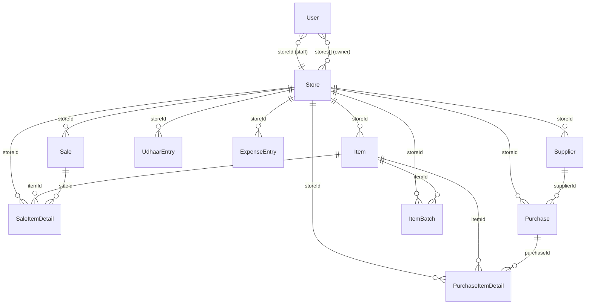

# 01 — Database Schema (Full)

## Master ER Diagram

---

## Cloud Database (PostgreSQL via Firebase Data Connect)

All tables are defined in `dataconnect/schema/schema.gql` and are managed by Data Connect's auto-migration system. All tenant-scoped tables use `storeId` for multi-tenancy. All business-data tables use soft-delete via `isDeleted` + `updatedAt`.

---

### Table: `Item`

**Purpose**: Represents an inventory item (product) in a store.

| Column | Type | Nullable | Default | Indexed | Notes |
|---|---|---|---|---|---|
| `id` | `String!` (UUID) | No | `uuidV4()` | PK | |
| `store_id` | `String!` | No | — | Yes (via queries) | Tenant partition |
| `name` | `String!` | No | — | | |
| `quantity` | `Float!` | No | — | | Current stock level |
| `unit` | `String!` | No | — | | e.g., "kg", "pcs" |
| `buyPrice` | `Float!` | No | — | | Purchase cost price |
| `sellPrice` | `Float!` | No | — | | Selling price |
| `lowStockThreshold` | `Float!` | No | — | | Alert threshold |
| `category` | `String!` | No | — | | e.g., "Grocery" |
| `photoPath` | `String` | Yes | null | | Local photo URI |
| `hsnCode` | `String` | Yes | null | | HSN code for GST |
| `taxRate` | `Float` | Yes | null | | GST rate (%) |
| `batchLotNumber` | `String` | Yes | null | | Legacy batch field |
| `expiryDate` | `String` | Yes | null | | Legacy expiry field |
| `is_deleted` | `Boolean!` | No | `false` | | Soft-delete flag |
| `updated_at` | `Float!` | No | — | | Epoch ms for sync |

**Relationships**: Parent of `SaleItemDetail`, `PurchaseItemDetail`, `ItemBatch` (via `@ref`).  
**Soft-delete**: Yes (`is_deleted`). Never hard-deleted.  
**Sample row**: `{ id: "a1b2c3d4-...", store_id: "store_xyz", name: "Toor Dal", quantity: 25.5, unit: "kg", buyPrice: 120.0, sellPrice: 150.0, lowStockThreshold: 5.0, category: "Grocery", hsnCode: "0713", taxRate: 5.0, is_deleted: false, updated_at: 1719993600000 }`

---

### Table: `Sale`

**Purpose**: Represents a sales transaction (invoice or estimate).

| Column | Type | Nullable | Default | Notes |
|---|---|---|---|---|
| `id` | `String!` (UUID) | No | `uuidV4()` | PK |
| `store_id` | `String!` | No | — | Tenant partition |
| `timestamp` | `Float!` | No | — | Epoch ms of sale |
| `totalAmount` | `Float!` | No | — | Grand total (incl. tax) |
| `discountAmount` | `Float!` | No | — | Flat discount applied |
| `customerName` | `String` | Yes | null | |
| `customerGstin` | `String` | Yes | null | Customer GSTIN |
| `businessGstin` | `String` | Yes | null | Seller GSTIN |
| `customerAddress` | `String` | Yes | null | |
| `businessAddress` | `String` | Yes | null | |
| `type` | `String!` | No | `"SALE"` | `SALE`, `ESTIMATE`, `CONVERTED` |
| `notes` | `String` | Yes | null | |
| `is_deleted` | `Boolean!` | No | `false` | Soft-delete |
| `updated_at` | `Float!` | No | — | Sync timestamp |

**Relationships**: Parent of `SaleItemDetail`.  
**Soft-delete**: Yes.

---

### Table: `SaleItemDetail`

**Purpose**: Line item within a sale (junction between Sale and Item).

| Column | Type | Nullable | Default | Notes |
|---|---|---|---|---|
| `id` | `String!` (UUID) | No | `uuidV4()` | PK |
| `store_id` | `String!` | No | — | |
| `sale_id` | `String!` | No | — | FK → Sale |
| `item_id` | `String!` | No | — | FK → Item |
| `itemName` | `String!` | No | — | Denormalized |
| `quantity` | `Float!` | No | — | |
| `unit` | `String!` | No | — | |
| `sellPrice` | `Float!` | No | — | At time of sale |
| `buyPrice` | `Float!` | No | — | At time of sale |
| `is_deleted` | `Boolean!` | No | `false` | |
| `updated_at` | `Float!` | No | — | |

**Relationships**: `sale: Sale! @ref`, `item: Item! @ref`  
**Cascade**: UNCONFIRMED — Data Connect `@ref` default behavior. Likely application-level cascade via soft-delete propagation.

---

### Table: `UdhaarEntry`

**Purpose**: Credit/debit ledger entry for a customer.

| Column | Type | Nullable | Default | Notes |
|---|---|---|---|---|
| `id` | `String!` (UUID) | No | `uuidV4()` | PK |
| `store_id` | `String!` | No | — | |
| `customerName` | `String!` | No | — | |
| `amount` | `Float!` | No | — | Always positive |
| `type` | `String!` | No | — | `CREDIT` or `PAYMENT` |
| `timestamp` | `Float!` | No | — | |
| `notes` | `String` | Yes | null | |
| `is_deleted` | `Boolean!` | No | `false` | |
| `updated_at` | `Float!` | No | — | |

**Balance calculation**: `SUM(CREDIT) - SUM(PAYMENT)` grouped by `customerName`. Positive = customer owes store.

---

### Table: `ExpenseEntry`

**Purpose**: Store expense record (overhead or restock cost).

| Column | Type | Nullable | Default | Notes |
|---|---|---|---|---|
| `id` | `String!` (UUID) | No | `uuidV4()` | PK |
| `store_id` | `String!` | No | — | |
| `type` | `String!` | No | — | `RESTOCK` or `OVERHEAD` |
| `description` | `String!` | No | — | |
| `amount` | `Float!` | No | — | |
| `timestamp` | `Float!` | No | — | |
| `supplierName` | `String` | Yes | null | |
| `supplierPhone` | `String` | Yes | null | |
| `is_deleted` | `Boolean!` | No | `false` | |
| `updated_at` | `Float!` | No | — | |

---

### Table: `Supplier`

**Purpose**: Supplier directory entry.

| Column | Type | Nullable | Default | Notes |
|---|---|---|---|---|
| `id` | `String!` (UUID) | No | `uuidV4()` | PK |
| `store_id` | `String!` | No | — | |
| `name` | `String!` | No | — | |
| `phone` | `String` | Yes | null | |
| `gstin` | `String` | Yes | null | |
| `address` | `String` | Yes | null | |
| `is_deleted` | `Boolean!` | No | `false` | |
| `updated_at` | `Float!` | No | — | |

---

### Table: `Purchase`

**Purpose**: Purchase bill from a supplier.

| Column | Type | Nullable | Default | Notes |
|---|---|---|---|---|
| `id` | `String!` (UUID) | No | `uuidV4()` | PK |
| `store_id` | `String!` | No | — | |
| `supplier_id` | `String!` | No | — | FK → Supplier |
| `supplierName` | `String!` | No | — | Denormalized |
| `totalAmount` | `Float!` | No | — | |
| `taxAmount` | `Float!` | No | `0.0` | |
| `type` | `String!` | No | `"BILL"` | `BILL` or `PAYMENT` |
| `timestamp` | `Float!` | No | — | |
| `notes` | `String` | Yes | null | |
| `is_deleted` | `Boolean!` | No | `false` | |
| `updated_at` | `Float!` | No | — | |

**Relationships**: `supplier: Supplier! @ref`

---

### Table: `PurchaseItemDetail`

**Purpose**: Line item within a purchase.

| Column | Type | Nullable | Default | Notes |
|---|---|---|---|---|
| `id` | `String!` (UUID) | No | `uuidV4()` | PK |
| `store_id` | `String!` | No | — | |
| `purchase_id` | `String!` | No | — | FK → Purchase |
| `item_id` | `String!` | No | — | FK → Item |
| `itemName` | `String!` | No | — | Denormalized |
| `quantity` | `Float!` | No | — | |
| `unit` | `String!` | No | — | |
| `buyPrice` | `Float!` | No | — | |
| `is_deleted` | `Boolean!` | No | `false` | |
| `updated_at` | `Float!` | No | — | |

**Relationships**: `purchase: Purchase! @ref`, `item: Item! @ref`

---

### Table: `ItemBatch`

**Purpose**: Batch/lot tracking for items with expiry dates.

| Column | Type | Nullable | Default | Notes |
|---|---|---|---|---|
| `id` | `String!` (UUID) | No | `uuidV4()` | PK |
| `store_id` | `String!` | No | — | |
| `item_id` | `String!` | No | — | FK → Item |
| `batchNumber` | `String` | Yes | null | |
| `expiryDate` | `Float` | Yes | null | Epoch ms |
| `quantity` | `Float!` | No | — | |
| `costPrice` | `Float!` | No | — | |
| `timestamp` | `Float!` | No | — | |
| `notes` | `String` | Yes | null | |
| `is_deleted` | `Boolean!` | No | `false` | |
| `updated_at` | `Float!` | No | — | |

**Relationships**: `item: Item! @ref`

---

### Table: `User`

**Purpose**: Application user (owner, staff, or admin).

| Column | Type | Nullable | Default | Notes |
|---|---|---|---|---|
| `id` | `String!` | No | — | PK (Firebase UID or phone) |
| `phoneNumber` | `String` | Yes | null | |
| `username` | `String` | Yes | null | |
| `createdAt` | `Float!` | No | — | |
| `role` | `String!` | No | `"owner"` | `owner`, `staff`, `admin` |
| `stores` | `[String]` | Yes | null | Store IDs owned |
| `storeId` | `String` | Yes | null | Assigned store (staff) |
| `ownerId` | `String` | Yes | null | Owner UID (staff) |
| `canViewProfit` | `Boolean` | Yes | `false` | Staff permission |
| `canDelete` | `Boolean` | Yes | `false` | Staff permission |
| `subscription_status` | `String` | Yes | null | `active`, `expired`, etc. |
| `subscription_plan` | `String` | Yes | null | Plan tier |
| `subscription_expires_at` | `Float` | Yes | null | Epoch |
| `subscription_platform` | `String` | Yes | null | `android`, `web` |
| `subscription_id` | `String` | Yes | null | Platform sub ID |

**Not soft-deleted** — users are never deleted, only their sessions are revoked.

---

### Table: `Store`

**Purpose**: Represents a tenant store instance.

| Column | Type | Nullable | Default | Notes |
|---|---|---|---|---|
| `id` | `String!` | No | — | PK |
| `name` | `String` | Yes | null | |
| `is_active` | `Boolean` | Yes | `true` | Can be deactivated by admin |
| `is_premium` | `Boolean` | Yes | null | |
| `subscription_expires_at` | `Float` | Yes | null | |
| `subscription_platform` | `String` | Yes | null | |
| `subscription_id` | `String` | Yes | null | |
| `subscription_status` | `String` | Yes | null | |

---

### Table: `GlobalSetting`

**Purpose**: System-wide key-value configuration (admin-managed).

| Column | Type | Nullable | Default | Notes |
|---|---|---|---|---|
| `id` | `String!` | No | — | PK |
| `key` | `String!` | No | — | **UNIQUE** |
| `value` | `String!` | No | — | |
| `description` | `String` | Yes | null | |
| `updated_at` | `Float!` | No | — | |
| `updated_by` | `String` | Yes | null | Admin UID |

---

### Table: `AdminAuditLog`

**Purpose**: Immutable audit trail for admin actions.

| Column | Type | Nullable | Default | Notes |
|---|---|---|---|---|
| `id` | `String!` (UUID) | No | `uuidV4()` | PK |
| `admin_id` | `String!` | No | — | |
| `adminUsername` | `String` | Yes | null | |
| `action` | `String!` | No | — | e.g., `GDPR_PURGE` |
| `targetId` | `String` | Yes | null | |
| `details` | `String` | Yes | null | |
| `timestamp` | `Float!` | No | — | |

**Hard-insert only** — no delete/update mutations defined (immutable log).

---

### Table: `Announcement`

**Purpose**: System announcements shown to all users.

| Column | Type | Nullable | Default | Notes |
|---|---|---|---|---|
| `id` | `String!` (UUID) | No | `uuidV4()` | PK |
| `title` | `String!` | No | — | |
| `message` | `String!` | No | — | |
| `type` | `String!` | No | `"info"` | `info`, `warning`, `critical` |
| `is_active` | `Boolean!` | No | `true` | |
| `created_at` | `Float!` | No | — | |

**Hard-delete**: Yes (via `DeleteAnnouncement` mutation).

---

### Table: `PromoCode`

**Purpose**: Promotional discount codes.

| Column | Type | Nullable | Default | Notes |
|---|---|---|---|---|
| `id` | `String!` | No | — | PK |
| `code` | `String!` | No | — | **UNIQUE** |
| `discount_percent` | `Float` | Yes | null | |
| `discount_amount` | `Float` | Yes | null | |
| `max_uses` | `Float` | Yes | null | |
| `current_uses` | `Float` | Yes | `0` | |
| `expires_at` | `Float` | Yes | null | |
| `is_active` | `Boolean!` | No | `true` | |

**Hard-delete**: Yes (via `DeletePromoCode` mutation).

---

## Local Database (Android SQLite)

The Android app uses a per-store SQLite database (`storebook_${storeId}.db`) managed by `StoreBookDbHelper.kt`. Current version: **9**.

### Key Differences from Cloud Schema

| Aspect | Local (SQLite) | Cloud (PostgreSQL) |
|---|---|---|
| Primary Keys | `INTEGER AUTOINCREMENT` | `UUID (String)` |
| Sync Tracking | `cloud_id TEXT`, `is_synced INTEGER` | Not needed (authoritative) |
| Timestamps | `INTEGER` (epoch ms) | `Float` (epoch ms) |
| Item name | `UNIQUE` constraint | No uniqueness enforced |

### Additional SQLite Columns (not in cloud)
- `cloud_id` (TEXT) — maps local row to cloud UUID
- `is_synced` (INTEGER) — 0=pending, 1=synced
- `deleted_timestamp` (INTEGER) — on `items` table only, tracks when soft-deleted

### Indexes (SQLite)
- `idx_items_deleted`, `idx_items_category`
- `idx_sale_items_sale_id`
- `idx_udhaar_customer`
- `idx_sales_timestamp`, `idx_expenses_timestamp`, `idx_purchases_timestamp`
- `idx_purchases_supplier_id`, `idx_purchase_items_purchase_id`
- `idx_item_batches_item_id`, `idx_item_batches_expiry`
- Per-table: `idx_{table}_cloud_id` (UNIQUE WHERE NOT NULL), `idx_{table}_is_synced`, `idx_{table}_updated_at`

### Migration History
| Version | Changes |
|---|---|
| 1–2 | Initial schema (items, sales, sale_items, udhaar, expenses) |
| 3 | Added sync columns (`cloud_id`, `is_synced`, `updated_at`, `is_deleted`) to all tables |
| 4 | Added `hsn_code`, `tax_rate` to items |
| 5 | Added `customer_gstin`, `business_gstin` to sales |
| 6 | Added `customer_address`, `business_address` to sales |
| 7 | Added `type` column to sales (for quotations) |
| 8 | Added `suppliers`, `purchases`, `purchase_items` tables |
| 9 | Added `item_batches` table |

### Downgrade Handling
On downgrade: **all tables are dropped and recreated**. Data recovery relies on `SyncWorker` pulling from cloud.
