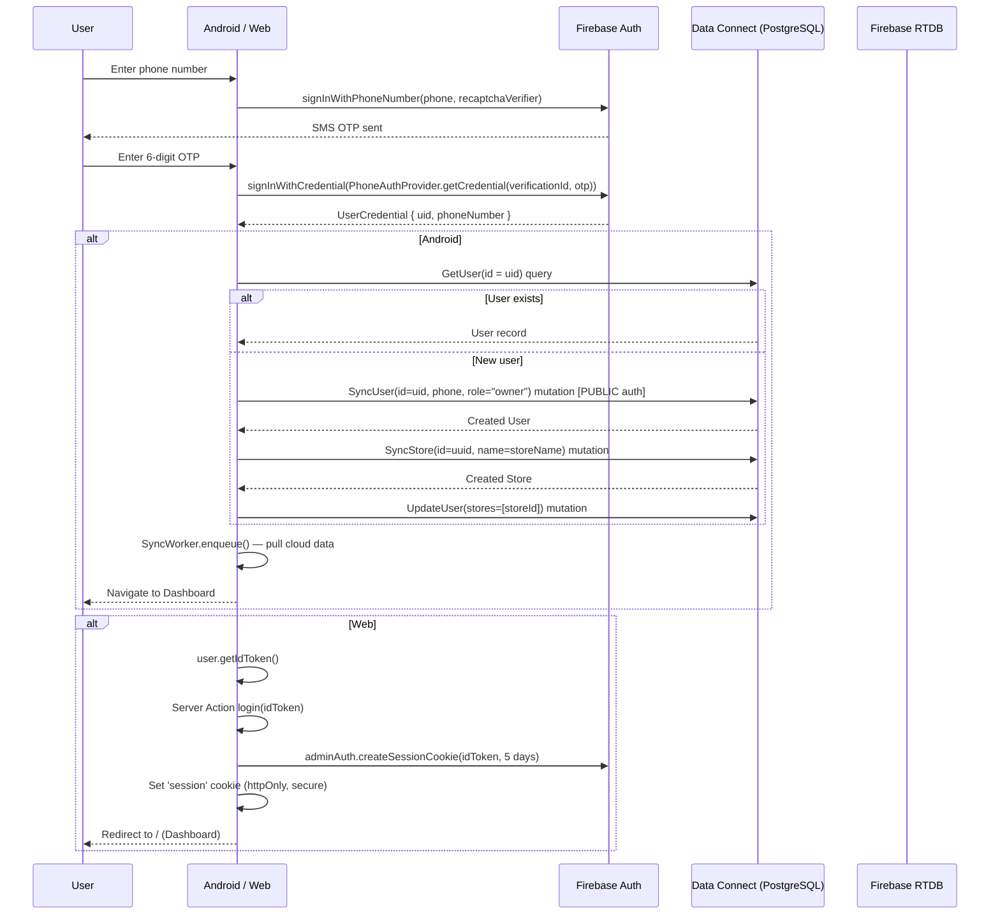

# 06 — Authentication & Authorization

## Authentication Flows

### Flow 1: Owner Login via Phone OTP



### Flow 2: Staff Login (Web Only)

1. Staff enters username + PIN.
2. Client derives virtual email: `{username.toLowerCase().replace(/[^a-z0-9]/g, '')}@storebook.internal`.
3. `signInWithEmailAndPassword(auth, virtualEmail, pin)`.
4. Same session cookie creation as owner flow.
5. `getSession()` resolves user from Data Connect → finds `role: "staff"`.
6. Staff is locked to their assigned `storeId` (cookie override ignored).

### Flow 3: Google Sign-In (Android Only)

1. Android `AuthScreen` presents Google Sign-In button.
2. Uses `GoogleAuthProvider` + `signInWithCredential()`.
3. Same post-auth user creation flow as Phone OTP.

---

## Session Management

### Android
- **Token**: Firebase Auth manages tokens natively. No explicit session cookie.
- **Persistence**: `FirebaseAuth.getInstance().currentUser` persists across app restarts.
- **Logout**: `FirebaseAuth.getInstance().signOut()`.
- **Store context**: Current `storeId` stored in EncryptedSharedPreferences.

### Web
- **Token type**: Firebase session cookie (server-generated).
- **Cookie name**: `session` (5-day expiry).
- **Creation**: `adminAuth.createSessionCookie(idToken, { expiresIn: 5 days })`.
- **Verification**: `adminAuth.verifySessionCookie(cookie, true)` — `true` enforces check against revoked tokens.
- **Active store**: Separate `activeStoreId` cookie (same expiry).
- **Logout**: Server action deletes both `session` and `activeStoreId` cookies.

---

## Authorization Model

### Role Hierarchy

| Role | Capabilities | Store Access |
|---|---|---|
| `owner` | Full CRUD on own stores, staff management, subscription | Own stores only (from `stores[]` array) |
| `staff` | Read + limited write (per `canViewProfit`, `canDelete` flags) | Assigned store only (`storeId`) |
| `admin` | All owner capabilities + user management + store toggling | Any store (via cookie) |
| `super_admin` | All admin capabilities + GDPR purge + data archival | Any store |

### Where Authorization is Enforced

| Check Point | Platform | Implementation |
|---|---|---|
| Data Connect | Both | `@auth(level: USER)` — only checks user is authenticated, **not role** |
| Server Actions | Web | Manual `session.role` checks in each action function |
| ViewModel | Android | Conditional UI rendering based on role/permissions in StoreBookViewModel |
| Session Resolution | Web | `getSession()` in `session.ts` — validates store access per role |

### IDOR Mitigation (Web)

**Source**: `web/src/lib/session.ts` (lines 42-58)

```typescript
if (role === 'staff') {
    // Staff locked to assigned store
    activeStoreId = userData?.storeId || '';
} else if (role === 'owner') {
    // Validate cookie against owned stores
    if (activeStoreIdCookie && (userData?.stores?.includes(activeStoreIdCookie) || userData?.storeId === activeStoreIdCookie)) {
        activeStoreId = activeStoreIdCookie;
    } else {
        activeStoreId = userData?.stores?.[0] || userData?.storeId || '';
    }
} else if (role === 'admin') {
    activeStoreId = activeStoreIdCookie || 'admin_dashboard';
}
```

### Store Switching

**Action**: `switchStore(storeId)` in `actions.ts`.
- Staff: throws `"Staff cannot switch stores"`.
- Owner: validates `session.stores.includes(storeId)`.
- Admin: unrestricted.
- Sets `activeStoreId` cookie on success.

---

## User Record Lifecycle

### New Owner Registration
```
1. Firebase Auth creates UID
2. SyncUser mutation creates User(id=uid, role="owner", phoneNumber=phone)
3. SyncStore mutation creates Store(id=uuid, name=storeName)
4. UpdateUser mutation sets User.stores=[storeId]
```

### Staff Account Creation
**Source**: `actions.ts` → `createStaffAccount()`

```
1. Validate caller is owner with a storeId
2. adminAuth.createUser({ email: virtualEmail, password: rawPin, displayName: username })
3. Data Connect: user_upsert(id=uid, role="staff", storeId=ownerStoreId, canViewProfit, canDelete)
```

### Session Revocation (Admin)
**Source**: `actions.ts` → `revokeUserSessions(userId)`

```
1. Validate caller is admin/super_admin
2. adminAuth.revokeRefreshTokens(userId)
```
This invalidates all existing sessions. On next cookie verification, `verifySessionCookie(cookie, true)` will fail.

---

## Firebase Admin SDK Setup

**Source**: `web/src/lib/firebaseAdmin.ts`

- Reads `service-account.json` from project root.
- Initializes Firebase Admin with `cert(serviceAccount)`.
- Exports `adminAuth` singleton.
- Error handling: logs initialization failure but does not crash (will fail on first auth call).

---

## Security Considerations

| Concern | Status | Notes |
|---|---|---|
| Session cookie httpOnly | ✅ | Prevents client-side JS access |
| Session cookie secure | ✅ | Only in production (`NODE_ENV === 'production'`) |
| Session verification | ✅ | Checks revocation (`true` flag) |
| Role-based Data Connect | ❌ | Not enforced — only `USER` level auth | 
| IDOR on store switching | ✅ | Validated server-side in session.ts |
| Staff PIN complexity | ❌ | No minimum length/complexity enforced |
| SyncUser PUBLIC auth | ⚠️ | Required for first-time registration but could be abused |
| Legacy phone-number IDs | ⚠️ | Fallback lookup by phone number in session.ts |
| Backdoor admin | ❌ | Code exists in `login()` but returns error ("not implemented") |
